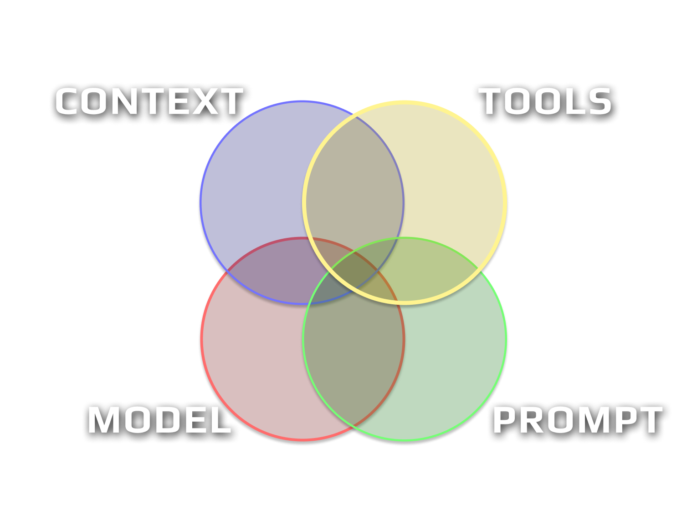

# Weather & Climate AI Chatbot

**Live Demo:** https://weather-chatbot-production.up.railway.app

## Can you explain your thought process when working on this and decisions that you made?

From the task description we have to do a chatbot with tool calling to get info on the weather, but also open enough such that it can answer different type of question using the weather context.

I therefore need an agent framework that not only answers messages but can use tool calling and think a bit before answering. I could have used the Claude Agent SDK — that is kind of the easy route and would be expensive and not necessarily the fastest. I have opted then for Pydantic AI and using OpenRouter such that I could test the app with different models including open source ones (I'd love to work with open source models!!).

I have built the app using Claude Code, spending time in plan mode to gather the context, my packages of choices, and initial thoughts. I run in plan mode such that it creates a spec and I iterate a bit until I am happy with the results. Then after that it pretty much one-shotted it.



To design an app with Claude Code and in this case an LLM-based app, I always think in this framework — **model, context, prompt, tools**:

- **Model:** Here we choose OpenRouter as this app can work with any model since it does not necessarily require a lot of thinking, and we can easily switch and test different performances.
- **Context:** Here we don't need that much context as the tools and the prompt will contain everything we need.
- **Tools:** Here we need to create tools using the weather API. I send the docs to my Claude Code agent and he is able to derive the necessary tools with what's available in the API.
- **Prompt:** Here we need to setup the prompt such that before user input it always checks the date and gives context of all the tools available. Since the task is well defined we can cheat a bit and give instructions on how to answer the 4 questions ;)

During plan mode, I use test-driven development (TDD) and I always ask Claude to use SOLID, DRY, and KISS principles — I notice it improves a lot the results and it is easier to add features after first release. I use contract-based tests based on the philosophy of this article: https://kumak.dev/testing-in-the-age-of-ai-agents/. I use [Exa Code](https://exa.ai/docs/reference/context) for docs and I have an Exa web researcher to search the internet for sources and examples. Here I used examples from Pydantic AI. I have tested the UI using the Playwright MCP server such that we test the UI automatically and Claude can validate. I use black, isort, ty, and ruff for linting. I use the official code-simplifier plugin from Anthropic to clean up my code after.

## How happy are you with the outcome?

Very happy, especially testing the UI with Playwright MCP as I am still testing this "close the loop" workflow. I am happy that Claude Code pretty much one-shotted the task and the 4 questions worked right away.

## What would be the first thing to improve?

Error handling, retry, and resilience. Also guardrails for prompt injection attacks and abusing the chatbot.

## How to Run

### Prerequisites

- Python 3.13+
- [uv](https://docs.astral.sh/uv/) package manager
- An [OpenRouter](https://openrouter.ai/keys) API key

### Setup

```bash
# Clone the repo
git clone git@github.com:TheJproject/weather-chatbot.git
cd weather-chatbot

# Install dependencies
uv sync

# Create a .env file with your API key
echo 'OPENROUTER_API_KEY=sk-or-...' > .env
echo 'OPENROUTER_MODEL=google/gemini-3-flash-preview' >> .env
```

### Run the Web UI

```bash
uvicorn src.web:app --host 127.0.0.1 --port 7932
```

Then open http://127.0.0.1:7932 in your browser.

### Run Tests

```bash
uv run pytest tests/ -v
```

### Linting

```bash
black src/ tests/ --line-length=120
isort src/ tests/ --profile black --line-length=120
ruff check src/ tests/
uvx ty check src/ tests/
```
